```{r setup, include=FALSE}
knitr::opts_chunk$set(comment = NA)
```

# Pair Formation Model Tutorial

## Model Overview

The pair formation model has been implemented using the extensions made available by the EpiModel package.  In particular, it has been implemented as a deterministic compartmental model (DCM) using an extended susceptible/infected ("SI") disease state trajectory.  This implementation differs from the standard two group, "SI" model in two ways.  First, we model pairs and individuals separately.  Pairs may be made up of individuals that are both susceptible, both infected or discordant.  Individuals move into and out of paired compartments and / or disease states.  Secondly, we model infection in two stages: acute (or primary) and chronic.  All newly infected individuals (and pair members) enter in the acute stage and then move to the chronic stage at a defined rate.  In addition, the acute phase can be given a "boost" factor in infectivity.

This vignette provides an overview of the Pair Formation model which can serve as a template for other EpiModel extensions.  EpiModel has its own vignette as well.  

### The Compartments

The Pair Formation Model uses a two group, heterogenous mixing model where persons exists as either individuals or in pairs. For ease of discussion, the two groups will be referred to as male and female.  There are no within-group contacts or with-in group pairings in this model.  The model compartments are further delineated by disease state: susceptible (S), primarily (P) or chronically infected (I). Pairs are compartmentalized based on each partner's disease state so that susceptible male - chronically infected female pairings would be in a different compartment from susceptible female - chronically infected male ones.  As a result, there are a total of 9 pair compartments.  Singles may be in one of three disease states making for 6 singles compartments making the total compartment count 15.
<br>
The compartment counts differ in that single compartments represent individuals, each member counting as one unit, while paired compartments represent couples, each couple counting as one unit.  When a partnership dissolved, the corresponding pair compartment decrements by one and each of the corresponding individual compartents increment by one.

### The Flows


The populations of the model compartments change based on three different types of "flows": demographic, pairing and infectious.  Each flow is described below.

#### Demographic flows

Demographic flows refer to births and deaths, but may also include migratory flows.  The birth (which may include immigration) and death (which may include migration) rates are specified using the inverse of the time step units.  For example, the rates may be in terms of per week, month or year.  Since coupling occurs throughout the "reproductive lifespan" of an individual, that span will typically represent the reproductive ages in the modeled society (for example, age 15-50 or 35 years).  While a death can occur in either single or paired compartments (causing movement from pairs to singles in the latter case), births (or immigration events) occur only to single compartments in this model.

<br>
The diagram below shows the demographic "flows" experienced by singles. The character codes used are as follows:
<br>
<br>
Sf1/Sm1 = susceptible single females/males
<br>
Pf1/Pm1 = single females/males in primary stage of infection
<br>
If1/Im1 = single females/males in chronic stage of infection 
<br>
<br>
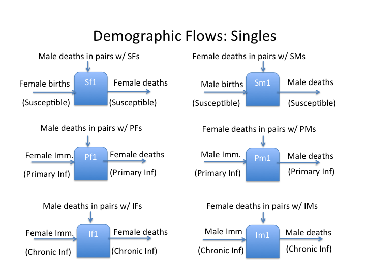
<br>
#### Pair Formation and Dissolution

Pairs are maintained using an initial pairs fraction applied to the total population, together with formation and dissolution rates.  All pairs experience the same rates.  A further extension would be to have some percentage of pairings being short-term and others being long-term.  As noted above, pairs may also be dissolved due to a death of one partner.

<br>
The diagram below shows the pair formation/dissolution "flows" relative to the singles compartments.  The two-letter character codes used indicate male/female disease status with in the partnership.
<br>
<pre>
Example: SS = pairs with both partners susceptible to disease while
         SP = pair with a susceptible male and a female in primary stage of infection
         etc.
</pre>
<br>
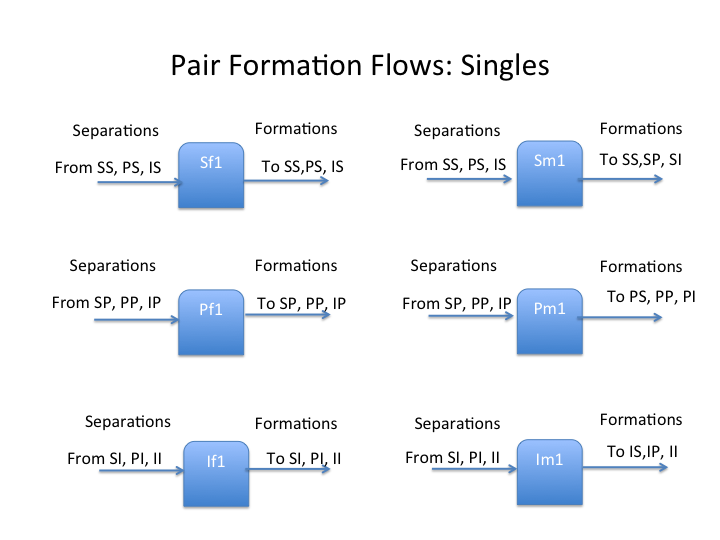
<br>
#### Infectious Flows

Infectious flows result from sexual contacts between individuals, within groups or between an individual and a pair member.  All pairings are between one member of group 1 (a female) and one member of group 2 (a male).  

The probability of a single individual coming into contact with an infected single is not based on the prevalence of all infected single persons, but only those of the opposite group (or gender).   The rate of contact between singles is specified separately from the rates between paired partners.  The rate of "one-off" couplings between an individual and a pair member is a third independent parameter.  All act rates are specified relative to one group with the act rate of the other group being determined based on the ratio of the two population (see the Balancing Act section of the EpiModel vignette).

<br>
The diagram below shows the infectious "flows" experienced by singles.
<br>
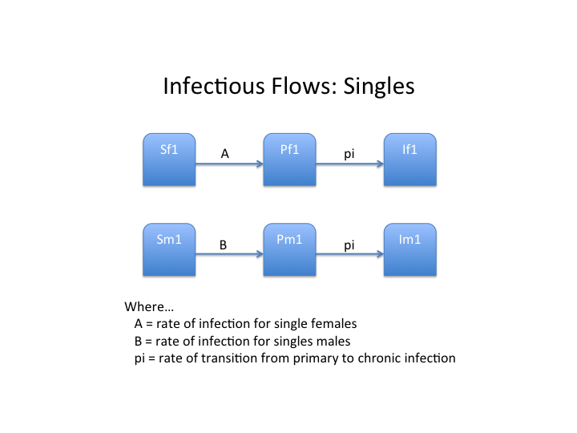
<br>
The diagram below shows the infectious "flows" experienced by pairs.  The flows are defined using the following symbols:
<br>
<br>
A = rate of infection for females in SS pairs
<br>
B = rate of infection for males in SS pairs
<br>
C = rate of infection for susceptible females partnered with primarily infected males
<br>
D = corresponding rate for males partnered with “P” females
<br>
E = rate of infection for susceptible females partnered with chronically infected males
<br>
F = corresponding rate for males partnered with “I” females
<br>
pi = rate of transition from primary to chronic infection
<br>
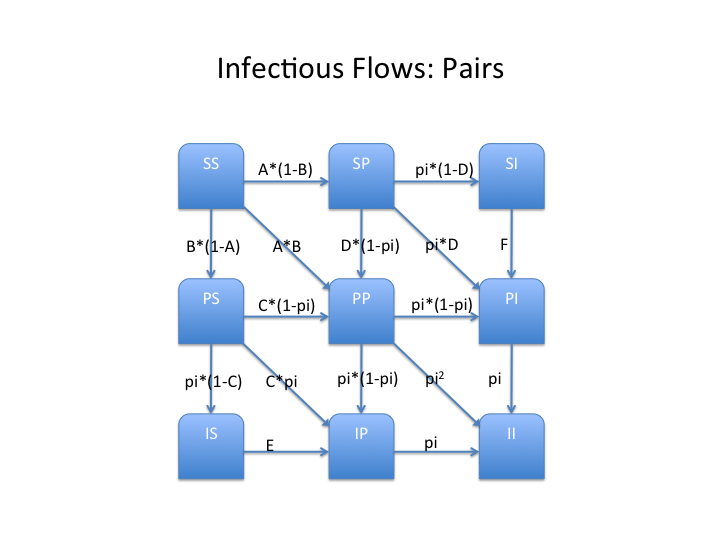
<br>

In the <b>Pair-wise Infectious Flow </b> diagram above, the probability of a transition "A" from SS to SP (infection of the female partner) is a dependent on her being infected from outside the relationship.  In this case, that is a combination between the chances of the single individual involved being either in primary or chronic stages of infection (with the appropriate "boost" if in primary).  The equation for A appears below:
<br>
<pre>

A = trans.rate*concur.fract*p_act.rate*
      (i1.num/msingles.num + pfactor*p1.num/msingles.num)
</pre>
<br>
<br>
The flow "C" from PS to PP includes both outside infection and with-in pair infection.  As such, the equation for "C" would be as follows:
<br>
<br>
<pre>
C = A + trans.rate*p_act.rate*pfactor
</pre>
<br>
<br>
All flows must be applied to the population in question at each time step.  The diagonal flows account for instances where both partners transition during a single time step.   The latter is made more likely as the size of the time steps are increased.

<br>
The diagram below shows all "flows" amongst both single and paired compartments.
<br>
<br>
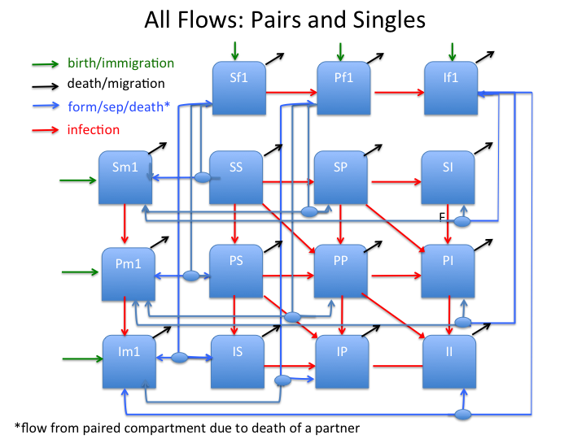
<br>
<br>
## Running the Pair Formation Model

First load the `EpiModel` package:
```{r, message=FALSE}
library(EpiModel)
```

Next source the `pf_model.R` file:
```{r, message=FALSE}
source("../R/pf_model.R")
```


From version 1.0 of the EpiModel package, deterministic compartmental models (DCMs) require three components: an initialization object (init), a parameterization object (param) and a control object (control).  These are created using the "init.dcm", "param.dcm" and "control.dcm" functions respectively.  

### The Init Object

We have introduced a special "init.pf" function to create the init.dcm object required by the dcm function  This was done because we wanted a simpler way to specify the initial populations: namely the "pairs.fract" measure.  This is used together with the overall group counts by infectious state to determine the initial populations of all compartments.  Alternatively, the user could call the "init.dcm" function with values for each of the compartments (we chose to not require that).
```{r}
init<-init.pf(
              s.num=500000,
              s.num.g2=500000,
              i.num=25000,
              i.num.g2=25000,
              pairs.fract=0.4)
```
### The Param Object 

With the "param.dcm" function, it is simple to add the additional parameters required by the pair formation model, "pf_model".  An example call to this function is shown below.  The parameters particular to the pair formation model are the pairing parameters: "formation.rate" and "separate.rate", the concurrence rates: "concur.rate" and "concur.rate.g2", the paired act rate: "p_act.rate", the acute (primary) infection boost factor: "pfactor" and the primary to chronic transition rate: "pi.rate".  The latter have been set using a time scale of months in this example.

```{r}
param <-param.dcm(
              formation.rate=0.025,
              separate.rate=0.01,
              concur.rate=0.05,
              concur.rate.g2=0.2,
              b.rate=0.006,
              b.rate.g2=NA,
              ds.rate=0.0024,
              ds.rate.g2=0.0024,
              di.rate=0.012,
              di.rate.g2=0.012,
              trans.rate = 0.004,
              trans.rate.g2 = 0.002, 
              balance="g1",
              p_act.rate = 4.0, 
              pi.rate = 0.25,
              pfactor=20.,
              act.rate = 1.0)
```
Note that if the group-specific birth rates are specified without the "s", "p" or "i" suffix, it is assumed to be just the susceptible rate.  Birth can also connote "immigration" for the other states.  All rates are expressed as a fraction of the overall population for the group.  In addition, if the male birth rate (b.rate.g2) is set to "NA" only the female population is used to calculate the new births.

### The Control Object 

With the control.dcm function, it is simple to insert a separate model (written in R in accordance with the EpiModel guidelines).  This is done with the "new.mod" argument as shown below.  For this example, we are running the model for 2 years using monthly time steps.  The subsequent call to the "dcm" function is shown as well using the three sample objects.

```{r}
control<-control.dcm(new.mod=pf_model,
            type = "SI",
            nsteps = 240,
            dt=0.1)

mod<-dcm(param,init,control)
```
### The Pair Formation R Code

The Pair Formation Model is encoded in the "pf_model" funcgtion.  It has been written to conform with the recommendations put forth in the <b>NewDCM<\b> vignette.  It expects lists containing the initial conditions and fixed parameters to be passed in the first two arguments.  It uses these to perform dynamic calculations that determine the change in the various model compartments.  These are then outputted as a list in the proper compartmental order together with other statistics that have been made available for plotting and analysis.

## Sample Output

Using the parameters and initial conditions specified above, the model has now executed.  To display its outputs, we can use the plot, print of summary functions provided for DCM models.  The model outputs for this model include all compartments, (singles have a 1 after the disease state indicator; pairs, a "p_" prefix), summary flows (si.flow, sp.flow, etc.) and summary totals (denoted by the "t_" prefix).  Several of the measures are output as fractional "prevalence" measures for convenience when plotting.  These have a "prev_" prefix.

### Printing outputs

Printing the model object shows all parameters and output of the model simulation. 
```{r}
print(mod)
```

### Plotting outputs

Unlike the simpler models, there is no pre-defiend "default" plot for a pair formation model.  This is due to the fact that the number of compartmeents exceeds the number supported by that function.  Instead, we must specify specific parameters to plot as shown below.

```{r, fig.width=9.5}
par(mfrow = c(1,1))
plot(mod, main="Disease Prevalence (%)",y=c("prev_p.num","prev_i.num"),popfrac=FALSE,
ylab="Percent", col=c("blue","red"))
```

## Sample Output 2: Removing concurrency

In this second example, we set the concurrency rates to zero for both groups to see the effect on the spread of infection.  The plot from example 1 is redisplayed for ease of comparison.

```{r}
param2 <-param.dcm(
              formation.rate=0.025,
              separate.rate=0.01,
              concur.rate=0.,
              concur.rate.g2=0.,
              b.rate=0.006,
              b.rate.g2=NA,
              ds.rate=0.0024,
              ds.rate.g2=0.0024,
              di.rate=0.012,
              di.rate.g2=0.012,
              trans.rate = 0.004,
              trans.rate.g2 = 0.002, 
              balance="g1",
              p_act.rate = 4.0, 
              pi.rate = 0.25,
              pfactor=20.,
              act.rate = 1.0)


mod2<-dcm(param2,init,control)
```

```{r, fig.width=9.5}
par(mfrow = c(1,2))
plot(mod, main="Disease Prevalence (%)",y=c("prev_p.num","prev_i.num"),popfrac=FALSE,
ylab="Percent",leg.name=c("primary","chronic"),
col=c("blue","red"))
plot(mod2, main="Disease Prevalence w/o Concurrency (%)",y=c("prev_p.num","prev_i.num"),popfrac=FALSE,
ylab="Percent",leg.name=c("primary","chronic"),
col=c("blue","red"))
```

## Sample Output 3: Removing pairs

In this third example, we set the pair fraction and pair formation rates to zero to see the effect on the spread of infection.  The plot from example 1 is redisplayed for ease of comparison.

```{r}
param3 <-param.dcm(
              formation.rate=0.,
              separate.rate=0.,
              concur.rate=0.05,
              concur.rate.g2=0.2,
              b.rate=0.006,
              b.rate.g2=NA,
              ds.rate=0.0024,
              ds.rate.g2=0.0024,
              di.rate=0.012,
              di.rate.g2=0.012,
              trans.rate = 0.004,
              trans.rate.g2 = 0.002, 
              balance="g1",
              p_act.rate = 4.0, 
              pi.rate = 0.25,
              pfactor=20.,
              act.rate = 1.0)

init3<-init.pf(
              s.num=500000,
              s.num.g2=500000,
              i.num=25000,
              i.num.g2=25000,
              pairs.fract=0.)

mod3<-dcm(param3,init3,control)
```

```{r, fig.width=9.5}
par(mfrow = c(1,2))
plot(mod, main="Disease Prevalence (%)",y=c("prev_p.num","prev_i.num"),popfrac=FALSE,
ylab="Percent",leg.name=c("primary","chronic"),
col=c("blue","red"))
plot(mod3, main="Disease Prevalence w/o Pairs (%)",y=c("prev_p.num","prev_i.num"),popfrac=FALSE,
ylab="Percent",leg.name=c("primary","chronic"),
col=c("blue","red"))
```

## Sample Output 4: Removing primary stage boost

In this fourth example, we set the primary "boost" multiplier to 1 and the "pi.rate" to 0 (which disables the use of the primary infection compartments).  The plot from example 1 is redisplayed for ease of comparison.

```{r}
param4 <-param.dcm(
              formation.rate=0.025,
              separate.rate=0.01,
              concur.rate=0.05,
              concur.rate.g2=0.2,
              b.rate=0.006,
              b.rate.g2=NA,
              ds.rate=0.0024,
              ds.rate.g2=0.0024,
              di.rate=0.012,
              di.rate.g2=0.012,
              trans.rate = 0.004,
              trans.rate.g2 = 0.002, 
              balance="g1",
              p_act.rate = 4.0, 
              pi.rate = 0.,
              pfactor=1.,
              act.rate = 1.0)

mod4<-dcm(param4,init,control)
```

```{r, fig.width=9.5}
par(mfrow = c(1,2))
plot(mod, main="Disease Prevalence (%)",y=c("prev_p.num","prev_i.num"),popfrac=FALSE,
ylab="Percent",leg.name=c("primary","chronic"),
col=c("blue","red"))
plot(mod4, main="Disease Prevalence w/o Boost (%)",y=c("prev_p.num","prev_i.num"),popfrac=FALSE,
ylab="Percent",leg.name=c("primary","chronic"),
col=c("blue","red"))
```

## Sample Output 5: Closed population

In this final example, we eliminate all demographic flows (births and deaths) so that the overall population does not change, only the disease prevalence.  The sample 1 plot is repeated here for reference.

```{r}
param5 <-param.dcm(
              formation.rate=0.025,
              separate.rate=0.01,
              concur.rate=0.05,
              concur.rate.g2=0.2,
              b.rate=0.006,
              b.rate.g2=NA,
              ds.rate=0.0024,
              ds.rate.g2=0.0024,
              di.rate=0.012,
              di.rate.g2=0.012,
              trans.rate = 0.004,
              trans.rate.g2 = 0.002, 
              balance="g1",
              p_act.rate = 4.0, 
              pi.rate = 0.25,
              pfactor=20.,
              act.rate = 1.0)

init5<-init.pf(
              s.num=500000,
              s.num.g2=500000,
              i.num=25000,
              i.num.g2=25000,
              pairs.fract=0.4)

mod5<-dcm(param5,init5,control)

param6 <-param.dcm(
              formation.rate=0.025,
              separate.rate=0.01,
              concur.rate=0.05,
              concur.rate.g2=0.2,
              trans.rate = 0.004,
              trans.rate.g2 = 0.002, 
              balance="g1",
              p_act.rate = 4.0, 
              pi.rate = 0.25,
              pfactor=20.,
              act.rate = 1.0)

init6<-init.pf(
              s.num=500000,
              s.num.g2=500000,
              i.num=25000,
              i.num.g2=25000,
              pairs.fract=0.4)

mod6<-dcm(param6,init6,control)
```

```{r, fig.width=9.5}
par(mfrow = c(1,2))
plot(mod5, main="Susceptible and Disease Populations\n(regular)",y=c("t_s.num","t_p.num","t_i.num","t_num"),popfrac=FALSE,
ylab="Population",leg.name=c("susceptible", "primary","chronic","total"),
col=c("blue","yellow","red","black"))
plot(mod6, main="Susceptible and Disease Populations\n(closed)",y=c("t_s.num","t_p.num","t_i.num","t_num"),popfrac=FALSE,
ylab="Population",leg.name=c("susceptible", "primary","chronic","total"),
col=c("blue","yellow","red","black"))
```
## Appendix 1: Initial conditions and parameters

The tables below show the variables to be passed to the "init.pf" and "param.dcm" functions respectively.  Some of these are shared with variables used for DCM 2 group SI models.
<br>
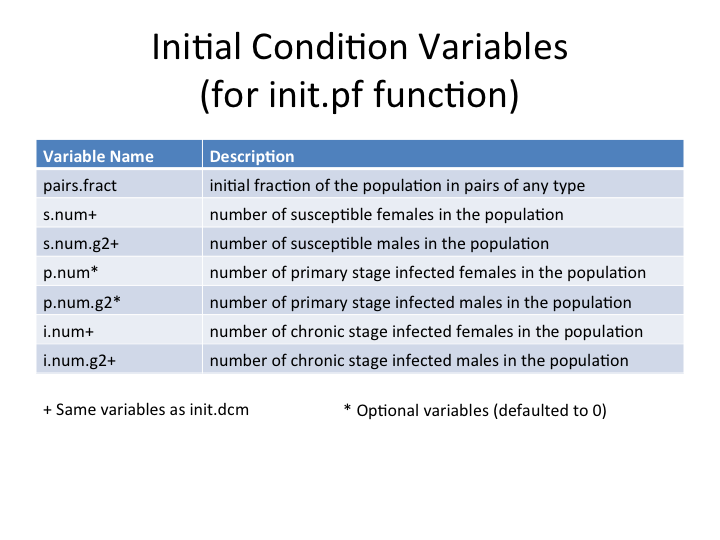
<br>
<br>
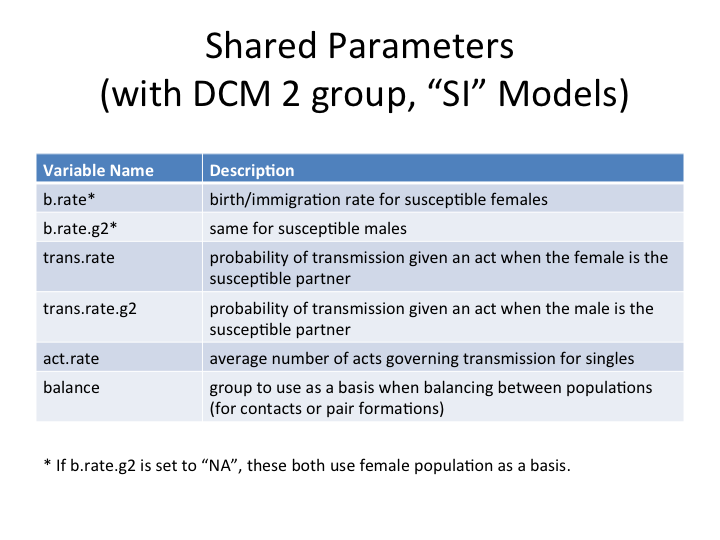
<br>
<br>
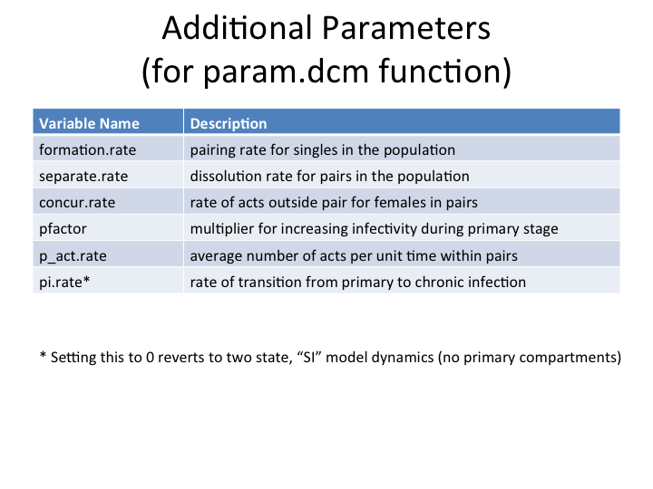
<br>
<br>
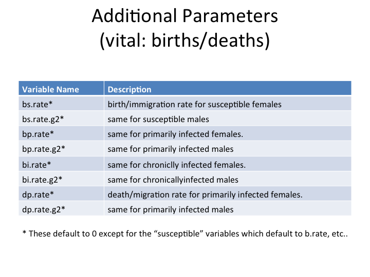
<br>
## Appendix 2: Output Variables

The tables below show the output variables that are available for use with printing and plotting functions.

<br>
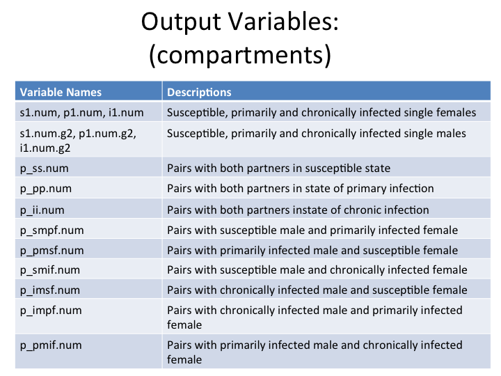
<br>
<br>
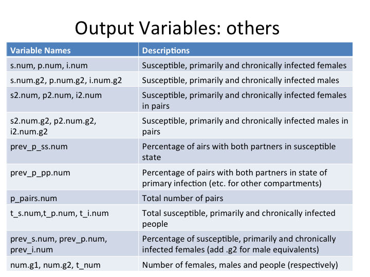
